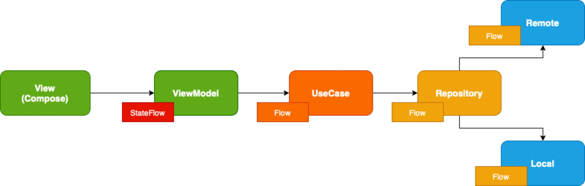
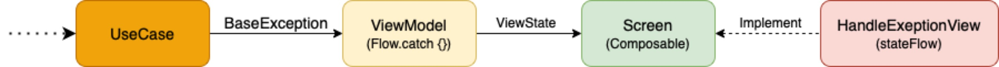

# Chase Weather app - Jetpack Compose Clean Architecture Example

Weather app is an example for show current weather from World Cities, built with Jetpack Compose.
The goal of the sample is to showcase the current UI capabilities of Compose.
Design pattern: Clean Architecture & MVVM
Added unit test for viewModel

### Data-Flow

I use the `Kotlin Flow` for data stream flow

### Error-Flow

All `Exceptions` from `API`, `Local` or `Invalid UseCase` will mapper to `BaseException`

